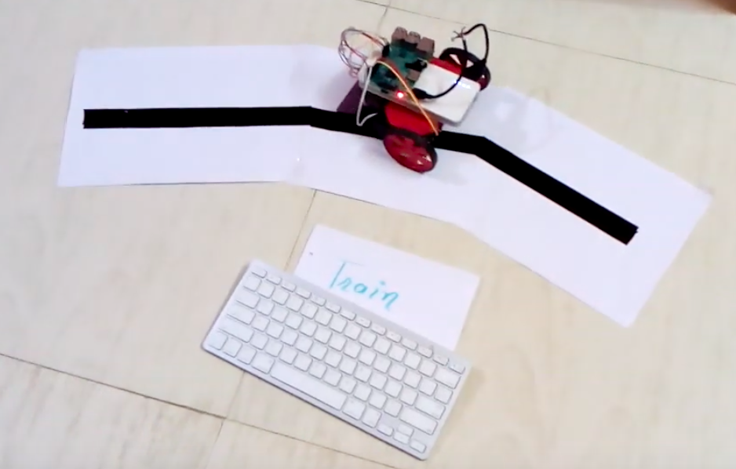

# Self-Learning-Robot
Reinforcement Training of Robot

Reinforcement learning is an important type of Machine Learning where an agent learn how to behave in a environment by performing actions and seeing the results.

In recent years, we’ve seen a lot of improvements in this fascinating area of research. Examples include DeepMind and the Deep Q learning architecture in 2014, beating the champion of the game of Go with AlphaGo in 2016, OpenAI and the PPO in 2017, amongst others.

### Reinforcement Learning is summarised as follows

### Points to remember in Reinforcement Learning

- Input: The input should be an initial state from which the model will start
- Output: There are many possible output as there are variety of solution to a particular problem
- Training: The training is based upon the input, The model will return a state and the user will decide to reward or punish the model based on its output.
- The model keeps continues to learn.
- The best solution is decided based on the maximum reward.

### Following URL guide you to the Reinforcement Learning in brief (Q Learning & Deep Q Learning)

https://medium.freecodecamp.org/an-introduction-to-reinforcement-learning-4339519de419

### Our Approach

Above code trains the line follower robot to follow line made for robot. It used Q Learning approach to learn by itself. In this approach our bot update its Q table entry for each state it encounters by hit and trial approach and once all the entries in Q table are updated successfully it ready to follow its path.  

### Result

